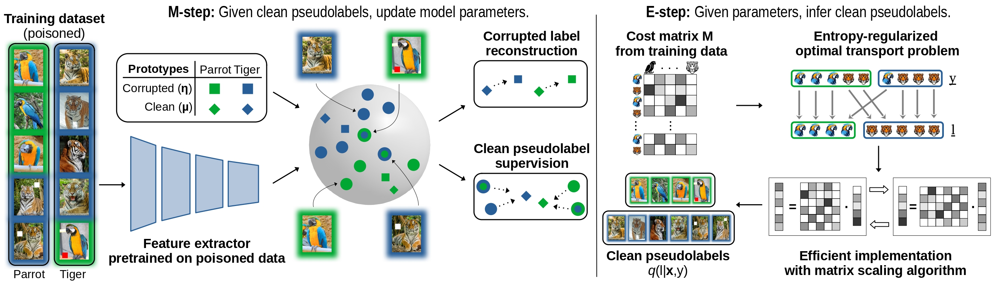

<div align="center">

# **[Seal Your Backdoor with Variational Defense](https://arxiv.org/abs/2503.08829)**
### **[(ICCV 2025)](https://arxiv.org/abs/2503.08829)**

</div>


<div align="center">

[](https://arxiv.org/abs/2503.08829)
[](LICENSE)

</div>

## 🔍 Overview

We propose VIBE, a model-agnostic framework that trains
classifiers resilient to backdoor attacks. The key concept
behind our approach is to treat malicious inputs and corrupted labels from the training dataset as observed random
variables, while the actual clean labels are latent. VIBE
then recovers the corresponding latent clean label posterior through variational inference. The resulting training procedure follows the expectation-maximization (EM)
algorithm. The E-step infers the clean pseudolabels by
solving an entropy-regularized optimal transport problem,
while the M-step updates the classifier parameters via gradient descent. Being modular, VIBE can seamlessly integrate with recent advancements in self-supervised representation learning, which enhance its ability to resist backdoor
attacks.

<p align="center">
  
</p>


## ⚙️ Installation

To install the required packages, run:
```bash
conda env create -f environment.yml
conda activate vibe
```

## 🖼️ Data Preparation
CIFAR-10 and CIFAR-100 are downloaded automatically inside the training scripts. ImageNet-30 subset has to be downloaded manually, and it is available [here](https://ferhr-my.sharepoint.com/:u:/g/personal/isabolic_fer_hr/EY25lL4iuRlIpiGEaUN-qRQBoSFhDoAyFZou0musYZN-bw?e=pVE0Qi).

```bash
mkdir -p data && cd data
# download the tarball here
tar -xzf imagenet_subset.tar.gz
rm imagenet_subset.tar.gz
cd ..
```

In order to run the experiments for LC, Frequency, Adap-Patch and Adap-Blend attacks, please download the corresponding poisoned datasets from [here](https://ferhr-my.sharepoint.com/:u:/g/personal/isabolic_fer_hr/IQC1A-YZn88ZQIZwB2nnvZpQAQNONoOXkYlLVzVarZVzi4Q?e=pHnFJc):

```bash
# download the tarball into the project root
tar -xzf poisoned_data.tar.gz
rm poisoned_data.tar.gz
```

ImageNet1k support will be added soon!

## 🚀 Training

To train VIBE, run `train.py` and provide one of the available configs. 
Within each config, VIBE expects a checkpoint to a self-supervised model trained on poisoned data. 
These checkpoints are available [here](https://ferhr-my.sharepoint.com/:f:/g/personal/isabolic_fer_hr/ErgXsI_3uMhAn53hgjda2OYB0K_f-hwtLhNZYZtYhTJGbg?e=tzMl8w).
Please refer to [checkpoints.md](checkpoints.md) to see more details about each self-supervised checkpoint. 

Downloaded checkpoint directories should be saved with path as `solo_models/all4one/{checkpoint_dir}`. 

For example, to test VIBE against the BadNets attack, run:

```bash
# VIBE-SS-F
python train.py --config-path configs --config-name backdoor_train_mixxcond backdoor=badnets

# VIBE-SS-A
python train.py --config-path configs --config-name backdoor_train backdoor=badnets

# VIBE-FM-F
python train.py --config-path configs --config-name backdoor_train_mixxcond_fm backdoor=badnets

# VIBE-FM-A
python train.py --config-path configs --config-name backdoor_train_fm backdoor=badnets
```

Alternatively, you can do the self-supervised training on your own by relying on the solo-learn framework. Please take a look at the solo-learn [README](solo-learn/README.md) for more details.

The models trained via self-supervision will be saved into `solo_models` directory. To use those, you can run:
```bash
python train.py --config-path configs --config-name backdoor_train_mixxcond \
  backdoor=blend model.backbone.ckpt_path="/path/to/ckpt"
```
You can also update [model configs](configs/model) accordingly. 

## Evaluation

To evaluate VIBE checkpoints, run `eval.py` and pass the checkpoint path via `model_path`:

```bash
# VIBE-SS-F 
python eval.py --config-path configs --config-name backdoor_eval_mixxcond model_path="/path/to/model.pth"

# VIBE-SS-A 
python eval.py --config-path configs --config-name backdoor_eval model_path="/path/to/model.pth"
```

Need a different attack or dataset? Override on the CLI, e.g. `backdoor=wanet dataset=cifar100`.

Note: If checkpoint loading mismatches occur, ensure the eval classifier matches the training classifier (x-conditioned vs standard).

Configs:
- Training: `configs/backdoor_train_mixxcond.yaml`, `configs/backdoor_train.yaml`
- Evaluation: `configs/backdoor_eval_mixxcond.yaml`, `configs/backdoor_eval.yaml`
